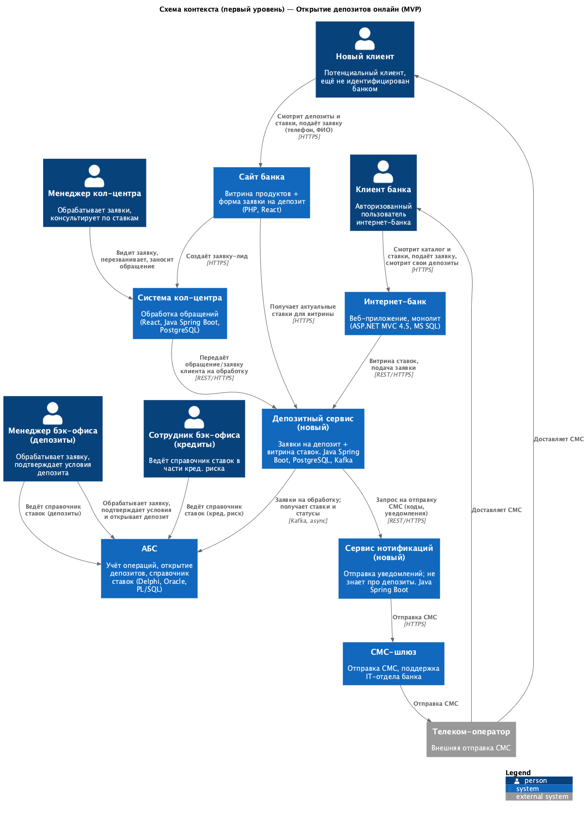
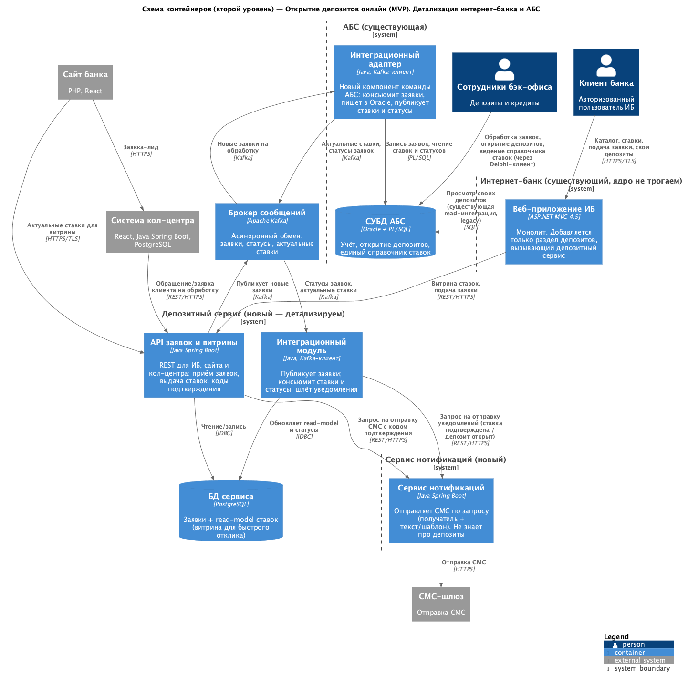

### **Название задачи:** Открытие депозитов онлайн (MVP) — концептуальная архитектура

### **Автор:** Никита Коник, команда цифровой трансформации розничного бизнеса

### **Дата:** 02.06.2026

### **Функциональные требования**

Верхнеуровневые Use Cases MVP открытия депозитов. Диаграммы C4 (раздел «Решение») покрывают все перечисленные сценарии.

|**№**|**Действующие лица или системы**|**Use Case**|**Описание**|
| :-: | :- | :- | :- |
| UC-1 | Новый клиент, Сайт, Депозитный сервис, Система кол-центра | Заявка на депозит с сайта | Новый клиент видит на сайте список депозитов с актуальными ставками (берутся из депозитного сервиса) и подаёт заявку, оставив телефон и Ф. И. О. Заявка-лид уходит в систему кол-центра, менеджер перезванивает и может предложить особые условия. Менеджер заносит обращение, которое передаётся в депозитный сервис и далее в АБС (через Kafka) — бэк-офис определяет ставку, клиент получает СМС. Онлайн это только лид: новый клиент не идентифицирован, для открытия депозита нужна офлайн-идентификация в отделении (FURPS +6). |
| UC-2 | Клиент банка, Интернет-банк, Депозитный сервис | Просмотр каталога и ставок в ИБ | Авторизованный клиент видит в интернет-банке каталог доступных депозитов с актуальными ставками. Ставки отдаются из витрины (read-model) депозитного сервиса без обращения к АБС. Персональные ставки в MVP не выводятся (считаются вручную, по запросу — вне MVP, см. FURPS F5). |
| UC-3 | Клиент банка, Интернет-банк, Депозитный сервис, СМС-шлюз | Подача заявки на депозит в ИБ | Клиент указывает счёт и сумму и подаёт заявку. Операция подтверждается СМС-кодом. Заявка регистрируется в депозитном сервисе и асинхронно передаётся в АБС. |
| UC-4 | Менеджер бэк-офиса, АБС | Обработка заявки и открытие депозита | Менеджер бэк-офиса получает заявку в АБС, подтверждает условия (ставку) и открывает депозит по существующему процессу. |
| UC-5 | АБС, Депозитный сервис, СМС-шлюз, Клиент | Уведомления о статусе | После подтверждения ставки и после открытия депозита клиент получает СМС-уведомления. Статусы приходят из АБС в депозитный сервис, который отправляет СМС через шлюз. |
| UC-6 | Сотрудники бэк-офиса (депозиты и кредиты), АБС | Ведение справочника ставок | Сотрудники бэк-офиса депозитов и кредитов ведут единый справочник ставок в АБС (вместо XLS). Актуальные ставки публикуются в витрину депозитного сервиса. |
| UC-7 | Клиент банка, Интернет-банк | Просмотр своих депозитов | Клиент видит свои открытые депозиты и счета в личном кабинете ИБ (через существующую интеграцию ИБ↔АБС; чтение, без нового нагрузочного потока). |

### **Нефункциональные требования**

Архитектурно значимые требования (источник — FURPS+, Task2).

|**№**|**Требование**|
| :-: | :- |
| НФТ-1 | Доступность сервисов 24/7 на уровне 99,9% (R1). |
| НФТ-2 | Отказоустойчивость: при сбое основного ЦОД — переключение на резервный (failover). Депозитный сервис, Kafka и адаптер развёрнуты в двух ЦОД (R2). |
| НФТ-3 | Быстрый отклик клиентских операций (миллисекунды), в т. ч. загрузка ставок/справочников. Витрина ставок отдаётся из локального read-model, без обращения к АБС (P1, +5). |
| НФТ-4 | Интернет-банк не обращается напрямую к API/БД АБС в новом процессе; интеграция асинхронная (R3, +5). БД АБС перегружена и масштабируется только вертикально. |
| НФТ-5 | Депозитный сервис — stateless, разворачивается в двух ЦОД (основа для failover, R2). Горизонтальное масштабирование — на перспективу (в MVP у банка два ЦОД: основной + резервный). |
| НФТ-6 | Шифрование трафика (TLS) на сайте и в интернет-банке (+1). |
| НФТ-7 | Ролевая модель доступа сотрудников; разделение данных депозитов и кредитов (+2). |
| НФТ-8 | Максимальный реюз стека банка (MS SQL, Oracle, Java, React); новые технологии — совместимые и с имеющейся экспертизой (+3). |
| НФТ-9 | Ядро интернет-банка не дорабатывается силами подрядчика; СМС-логика — силами команды банка (+4, F7). |
| НФТ-10 | Очереди сообщений на Kafka (стратегический выбор, +7); депозитный функционал — отдельный сервис/микросервис (+8). |
| НФТ-11 | Разработка документации для дальнейшего расширения системы (S1). |
| НФТ-12 | Клиентские интерфейсы соответствуют корпоративной дизайн-системе и основным паттернам UI/UX (U1, U2). |

### **Решение**

Выделяем депозитный функционал в отдельный микросервис, не трогая старые АБС и ИБ.
Во избежание нагрузки на БД интегрируем новый сервис с АБС асинхронно через Kafka. Бэк-офис продолжает считать и согласовывать ставки прежним процессом, но ведёт их в едином справочнике (вместо Excel-файлов), а новый сервис реплицирует их к себе.
Ядро интернет-банка не меняется — добавляется только раздел депозитов, вызывающий сервис по REST.

#### Схема контекста (первый уровень)

Перенесли на схему всех действующих лиц и системы из Use Cases:
- **Действующие лица:** новый клиент, клиент банка, менеджер кол-центра, менеджер бэк-офиса (депозиты), сотрудник бэк-офиса (кредиты).
- **Системы:** Сайт, Интернет-банк, Депозитный сервис (новый), АБС, Система кол-центра, Сервис нотификаций (новый), СМС-шлюз, Телеком-оператор.

Взаимодействия на стрелках подписаны так, чтобы каждый Use Case достигал цели:
- **UC-1** — новый клиент на Сайте смотрит ставки (Сайт берёт их из Депозитного сервиса) и оставляет заявку-лид → Система кол-центра → менеджер заносит обращение → Депозитный сервис → АБС.
- **UC-2, UC-3** — клиент банка в ИБ смотрит каталог/ставки и подаёт заявку → ИБ → Депозитный сервис.
- **UC-4, UC-6** — бэк-офис обрабатывает заявку и ведёт справочник ставок в АБС.
- **UC-5** — статусы из АБС → Депозитный сервис → Сервис нотификаций → СМС-шлюз → Телеком-оператор → клиент.
- **UC-7** — клиент банка смотрит свои депозиты в ИБ.

Архитектурные допущения, принятые уже на схеме контекста:
- Вводим **Депозитный сервис** как новую систему — единую точку приёма заявок и витрину ставок, чтобы не замыкать онлайн-поток на перегруженную АБС (НФТ-4).
- СМС-функционал реализован в ядре ИБ, но дорабатывать его силами подрядчика не хотим. Отправку СМС выносим в отдельный **Сервис нотификаций** (силами банка), который шлёт сообщения через существующий **СМС-шлюз** (далее через Телеком-оператора). Так СМС-логика уходит из зоны подрядчика, а отправка уведомлений переиспользуется под другие продукты.
- Интеграция с АБС — **асинхронная**; конкретный механизм (Kafka) уточняется на схеме контейнеров.

На схеме контекста уже видно, что функциональные требования выполняются и какие системы задействованы. Дальше детализируем до контейнеров, чтобы учесть нефункциональные требования.

#### Схема контейнеров (второй уровень) — детализация интернет-банка и АБС

Детализируем контейнеры, увязывая каждый выбор с конкретным требованием.

**Депозитный сервис (новый):**
- *НФТ-10 (+7, +8).* Выносим депозиты в отдельный сервис/микросервис: монолит ИБ (.NET 4.5) несовместим с Kafka и завязан на подрядчика. Для очередей — **Kafka** (стратегический выбор банка).
- *НФТ-8 (+3).* Стек — **Java Spring Boot** (Java-экспертиза есть в команде АБС и кол-центре) и **PostgreSQL** (уже эксплуатируется кол-центром): реюз стека и совместимость с Kafka.
- *НФТ-3 (P1).* В БД сервиса держим **read-model ставок** (витрину) → отклик в миллисекундах без обращения к АБС. Источник истины — АБС; синхронизация через Kafka (eventual consistency, для витрины допустимо).
- *НФТ-4 (+5, R3).* Интеграция с АБС только через **Kafka**: `API заявок` публикует заявки, `интеграционный модуль` консьюмит ставки и статусы. Прямых запросов к БД АБС нет; заявки буферизуются при недоступности АБС.
- *НФТ-9 (+4, F7).* OTP-логику (генерация и проверка кода) и формирование текста делает сам сервис, а **доставку СМС делегирует Сервису нотификаций** — ядро ИБ подрядчиком не дорабатываем.

**Сервис нотификаций (новый):**
- *SRP / F7.* Отдельный сервис на **Java Spring Boot**: принимает запрос «отправить СМС» (получатель + текст/шаблон) и шлёт через СМС-шлюз. Не знает про депозиты — переиспользуется под любые уведомления (кредиты, платежи в будущем).
- Связь от депозитного сервиса — синхронный **REST** (коду подтверждения нужна низкая задержка).

**Интернет-банк:**
- *НФТ-9 (+4).* Добавляем только **раздел депозитов** в `Веб-приложение ИБ`, который вызывает Депозитный сервис по REST/HTTPS. Ядро монолита (зона подрядчика) не меняем.
- *F3.* Авторизация — существующий механизм ИБ, переиспользуется.
- *UC-7 (техдолг).* Просмотр своих депозитов — через существующую read-интеграцию ИБ↔АБС (`БД АБС`); новый нагрузочный поток сюда не добавляем.

**АБС:**
- *НФТ-4 (+5).* Вводим **интеграционный адаптер** (Java, Kafka-клиент), который делают Java-специалисты команды АБС: консьюмит заявки из Kafka и пишет в Oracle через PL/SQL, публикует ставки и статусы. Так АБС уходит из онлайн-критического пути.
- *F8.* Единый **справочник ставок** ведётся в `СУБД АБС` (Oracle/PL-SQL) вместо XLS; доступ бэк-офиса депозитов и кредитов — через десктоп-клиент (Delphi).
- *НФТ-1, НФТ-2, НФТ-5 (R1/R2).* АБС масштабируется только вертикально и остаётся в одном экземпляре, но за счёт асинхронности не блокирует онлайн. Депозитный сервис и Kafka разворачиваются в **двух ЦОД** (active/standby, failover) — это уровень deployment.

**Допущение по СУБД.** Для нового сервиса берём PostgreSQL как допущение; при появлении дополнительных требований выбор СУБД можно вынести в отдельный ADR.

#### Команды, участвующие в разработке

- **Команда интернет-банка** (банк + подрядчик) — раздел депозитов в ИБ, вызовы депозитного сервиса.
- **Новая/выделенная команда депозитного сервиса** — сервис заявок, витрина ставок, интеграция с Kafka, вызовы сервиса нотификаций.
- **Команда сервиса нотификаций** (может совпадать с командой депозитного сервиса) — отправка СМС через шлюз.
- **Команда АБС** (вкл. Java-специалистов) — интеграционный адаптер, справочник ставок, процесс согласования.
- **Команда кол-центра** (подрядчик) — приём заявок-лидов с сайта.
- **IT-отдел банка** — СМС-шлюз; инфраструктура Kafka и второго ЦОД.

### **Альтернативы**

1. **Прямая интеграция ИБ ↔ АБС (синхронно).** Минимум новых компонентов: монолит ИБ обращается к API/БД АБС напрямую. Отклонено: нагружает перегруженную вертикальную БД АБС, нарушает R3/+5, требует доработки ядра ИБ подрядчиком, не даёт 99,9% и масштабирования.
2. **Реализовать всё внутри АБС** (заявки и витрина — в АБС, ИБ просто открывает её экраны). Отклонено: усиливает нагрузку на АБС, единственная точка отказа, вертикальное масштабирование, риск для работоспособности банка.
3. **Доработать монолит ИБ под депозиты без отдельного сервиса.** Отклонено: платформа .NET 4.5 несовместима с Kafka, обновление ядра привязано к подрядчику, нет независимого масштабирования.
4. **Другой брокер (RabbitMQ и т. п.) вместо Kafka.** Отклонено: Kafka выбрана стратегически на перспективу (+7), под неё закладываем экспертизу.

**Недостатки, ограничения, риски**

- **Новый сервис и Kafka** — новая инфраструктура и эксплуатация (мониторинг, два ЦОД), нужны компетенции по Kafka, которых в банке ещё нет.
- **Eventual consistency.** Витрина ставок и статусы заявок обновляются с задержкой относительно АБС. Для MVP-витрины допустимо, но требует контроля рассинхронизации.
- **Зависимость от команды АБС.** Интеграционный адаптер и публикация ставок делаются Java-специалистами команды АБС — это узкое место по ресурсам и срокам.
- **Ручная обработка в MVP.** Заявку и ставку подтверждает менеджер бэк-офиса (UC-4); персональные ставки считаются вручную → задержки, неполная автоматизация. Полное автооткрытие — целевое состояние (год).
- **Просмотр своих депозитов (UC-7)** работает через legacy read-интеграцию ИБ↔АБС — технический долг; в целевом состоянии желательно перевести и этот путь на сервис/реплику.
- **АБС остаётся вертикально масштабируемой** — потолок по нагрузке сохраняется, но вынесен из онлайн-критического пути за счёт асинхронности.
