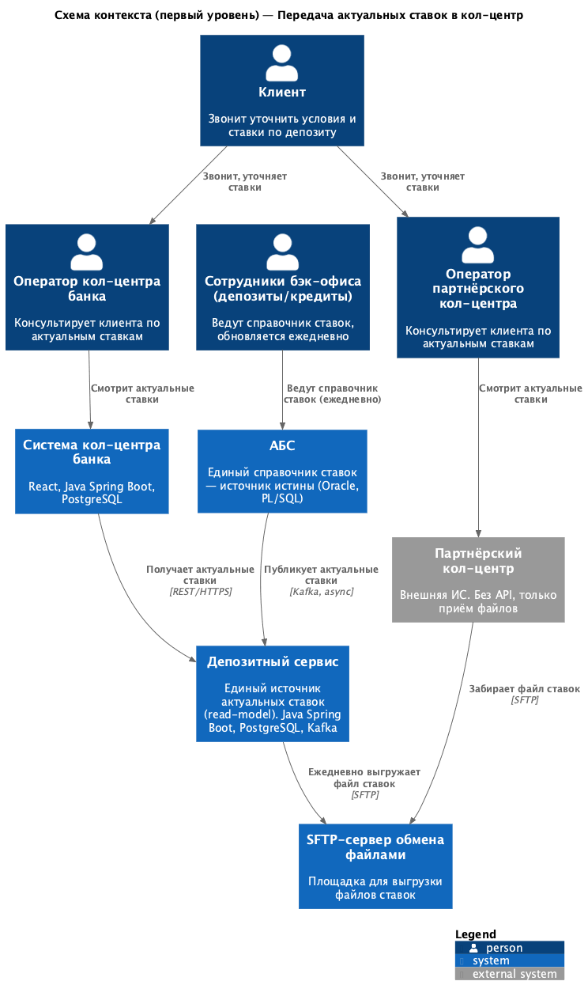
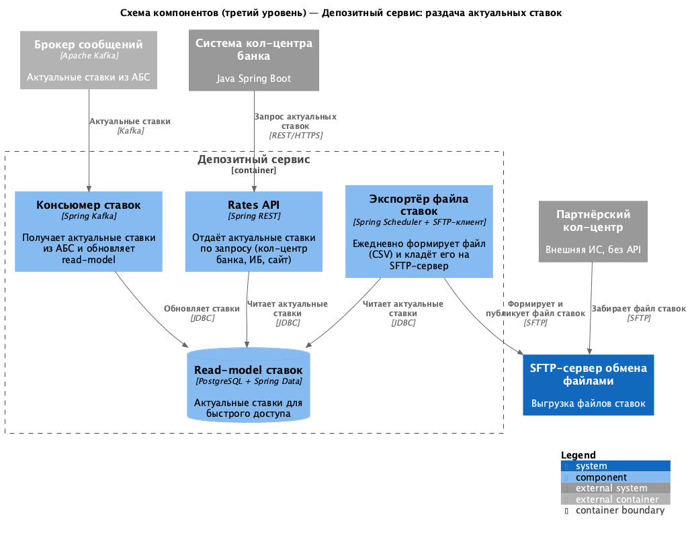

### **Название задачи:** Передача актуальных ставок в кол-центр (банка и партнёрский)

### **Автор:** Никита Коник, команда цифровой трансформации розничного бизнеса

### **Дата:** 02.06.2026

### **Контекст и проблема**

После запуска маркетинговой кампании ожидается рост звонков, в т. ч. от пожилых клиентов, которым проще уточнить условия депозита по телефону. Чтобы операторы могли консультировать по актуальным ставкам и не перегружать кол-центр, нужно:

1. Дать системе кол-центра банка доступ к актуальным депозитным ставкам.
2. Подключить партнёрский кол-центр и наладить передачу ему актуальных ставок. Партнёр работает во внешней ИС, **API-вызовы невозможны** — обмен только файлами (SFTP).

Опираемся на текущий процесс работы со ставками: депозитный сервис уже хранит актуальные ставки в своём read-model и выступает прямым источником данных для кол-центров.

### **Функциональные требования**

Диаграммы C4 (раздел «Решение») покрывают все Use Cases.

|**№**|**Действующие лица или системы**|**Use Case**|**Описание**|
| :-: | :- | :- | :- |
| UC-1 | Клиент, Оператор кол-центра банка, Система кол-центра, Депозитный сервис | Консультация по ставкам (банк) | Клиент звонит в кол-центр банка. Оператор видит актуальные ставки в своей системе; система получает их из депозитного сервиса по REST. |
| UC-2 | Клиент, Оператор партнёрского кол-центра, Партнёрский кол-центр, SFTP | Консультация по ставкам (партнёр) | Клиент звонит в партнёрский кол-центр. Оператор видит актуальные ставки в своей ИС, куда они загружены из файла, полученного по SFTP. |
| UC-3 | Бэк-офис, АБС, Депозитный сервис, SFTP | Ежедневная актуализация ставок | Бэк-офис ведёт справочник ставок в АБС (обновляется ежедневно). Ставки публикуются в депозитный сервис, далее доступны кол-центру банка (API) и партнёру (файл по SFTP). |

### **Нефункциональные требования**

|**№**|**Требование**|
| :-: | :- |
| НФТ-1 | Единый и прямой источник ставок — read-model депозитного сервиса; прямой нагрузки на БД АБС нет (+5). |
| НФТ-2 | Актуальность ставок: ежедневное обновление (как в текущем процессе). Файл партнёру содержит дату актуальности. |
| НФТ-3 | Безопасность обмена с партнёром: SFTP (шифрование канала), доступ по ключам. Партнёру передаются только публичные ставки, без персональных данных клиентов. |
| НФТ-4 | Партнёрский кол-центр — внешняя ИС без API; интеграция только файловая. |
| НФТ-5 | Доступность сервиса раздачи ставок 24/7 (99,9%); контроль и мониторинг доставки файла. |
| НФТ-6 | Реюз стека и компонентов: депозитный сервис (Java Spring Boot), система кол-центра (Java) — интеграция по REST (+3). |
| НФТ-7 | Целостность файла ставок (формат CSV, контрольная проверка перед публикацией). |

### **Решение**

Наш депозитный сервис — **прямой и единый источник актуальных ставок** для обоих кол-центров. Свой кол-центр (в инфраструктуре банка, Java) получает ставки по **REST API** в реальном времени. Для партнёра, который не может вызывать API, организуется **файловый обмен по SFTP**: сервис ежедневно формирует файл ставок и публикует его на SFTP-сервере, откуда партнёр его забирает.

#### Схема контекста (первый уровень)

#### Схема компонентов (третий уровень) — депозитный сервис

#### Описание компонентов и интеграций

Раздачу ставок обеспечивают компоненты депозитного сервиса:

- **Консьюмер ставок** (Spring Kafka) — получает актуальные ставки из АБС (через Kafka) и обновляет read-model.
- **Read-model ставок** (PostgreSQL) — локальный источник актуальных ставок для быстрого доступа.
- **Rates API** (Spring REST) — отдаёт актуальные ставки по запросу; используется системой кол-центра банка (а также ИБ и сайтом).
- **Экспортёр файла ставок** (Spring Scheduler + SFTP-клиент) — ежедневно формирует файл (CSV) с актуальными ставками и датой и кладёт его на SFTP-сервер обмена.

Внешние участники: **система кол-центра банка** (REST к Rates API), **SFTP-сервер**, **партнёрский кол-центр** (забирает файл по SFTP), **АБС** (источник истины, публикует ставки через Kafka).

#### Логика выбора решения

- **Единый источник — депозитный сервис, а не АБС.** Read-model ставок в сервисе уже наполнен; раздача из сервиса не нагружает перегруженную БД АБС (НФТ-1) и даёт быстрый отклик.
- **Свой кол-центр — по REST.** Система кол-центра на Java в инфраструктуре банка, имеет возможности расширения — интеграция по API проще и даёт актуальные данные в реальном времени.
- **Партнёр — по файлам (SFTP).** У партнёра нет возможности API-вызовов (НФТ-4) — остаётся файловый обмен. SFTP шифрует канал и работает по ключам (НФТ-3). Файл — раз в день, т. к. ставки обновляются ежедневно (НФТ-2).
- **Без персональных данных партнёру.** В файле — только публичные актуальные ставки, что снимает часть рисков по безопасности.

### **Альтернативы**

1. **Партнёр через API/Kafka.** Отклонено: у партнёра нет возможности делать API-вызовы — только файлы.
2. **Кол-центры читают ставки напрямую из АБС.** Отклонено: нагрузка на перегруженную вертикальную БД АБС, а партнёр — внешняя система (доступ небезопасен).
3. **Передача ставок партнёру по электронной почте** (как сейчас передают скрипты звонков). Отклонено: не автоматизировано, нет контроля целостности и доставки, ручной труд.
4. **Свой кол-центр тоже через файлы.** Отклонено: избыточно — система банка может интегрироваться по API и получать данные в реальном времени.
5. **Отдельный веб-раздел (портал) со ставками и ролью для операторов.** Поднять отдельный раздел/портал, куда выгружаются ставки; оператор партнёрского кол-центра (с отдельной ролью) смотрит их в рантайме через браузер по REST — туда же можно направить и операторов нашего кол-центра.
   - *Плюс:* одно место и одна доработка для обоих кол-центров.
   - *Минус:* для наших операторов информация размывается по разным системам — приходится работать в системе кол-центра и параллельно смотреть отдельный раздел.

**Недостатки, ограничения, риски**

- **Файловый обмен — задержка.** Партнёр получает ставки раз в день; внутри дня возможна рассинхронизация. Для консультаций допустимо, т. к. ставки и так обновляются ежедневно.
- **SFTP-обмен.** Нужны управление ключами/доступом, мониторинг и обработка сбоев выгрузки (файл не сформирован/не доставлен).
- **Партнёр — внешняя сторона.** Нет контроля, как и когда партнёр загружает и использует файл; риск устаревших данных на их стороне.

---

## Список крупных задач по системам

| Система | Команда | Задача |
|---------|---------|--------|
| **Депозитный сервис** | Команда депозитного сервиса | Rates API для системы кол-центра; экспортёр файла ставок (CSV, ежедневно) с выгрузкой на SFTP; планировщик; контракт/формат файла. |
| **АБС** | Команда АБС (Java-специалисты) | Ведение единого справочника ставок (депозиты + кредиты); публикация актуальных ставок в Kafka. |
| **Система кол-центра банка** | Подрядчик кол-центра + Java-специалисты | Интеграция с Rates API депозитного сервиса; отображение актуальных ставок оператору. |
| **Инфраструктура / IT** | IT-отдел банка | Развернуть SFTP-сервер; управление ключами и доступом; мониторинг формирования и доставки файла. |
| **Партнёрский кол-центр** | Партнёр (внешняя команда) | Настроить приём файла по SFTP и загрузку ставок в свою ИС; отображение ставок оператору. |
